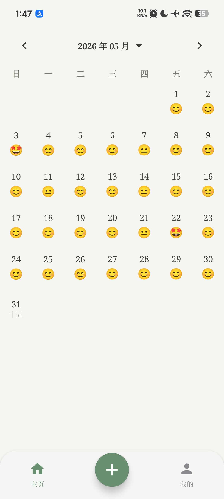
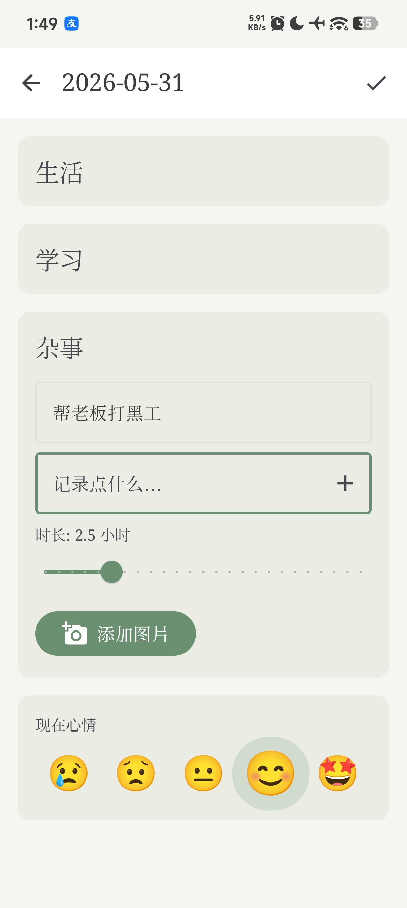
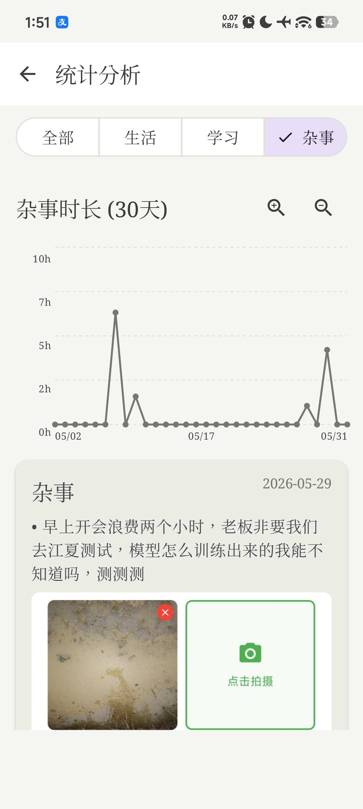
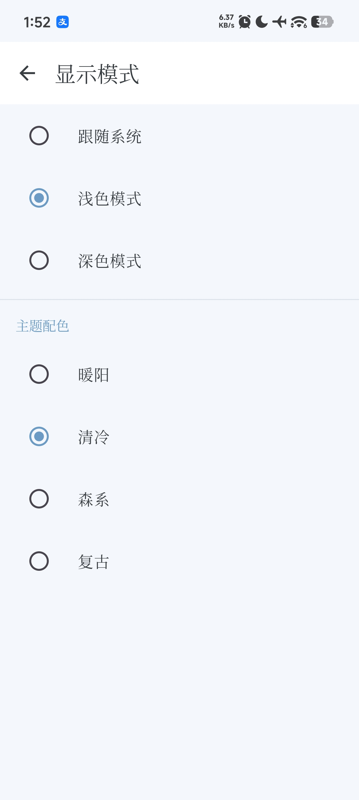
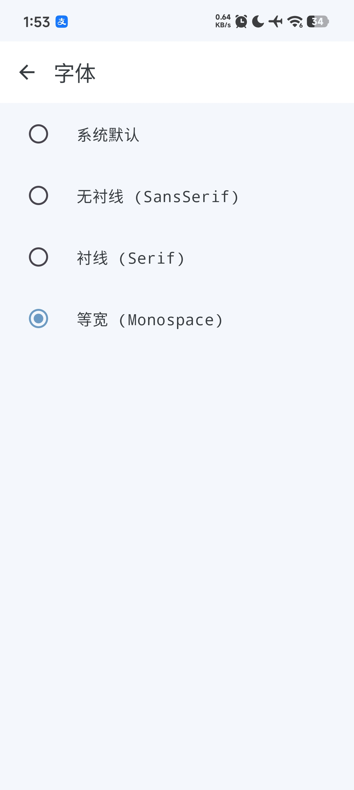
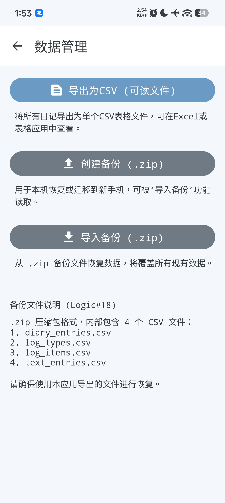

# Easy Diary

极简日记本 — 用优雅的方式记录每一天。

## 功能亮点

### 日记日历
支持 **月视图** 和 **周视图** 切换，日期格内显示农历与心情 Emoji，左右滑动手势切换月份/周。点击日期即可进入编辑页。

### 日记编辑
每篇日记包含：
- **心情评分** — 5 级 Emoji 表情
- **三类记录卡** — 可自定义类别（如工作、学习、运动），每类可添加文本记录、时长统计和配图
- **明日计划** — 为第二天做好准备
- 支持左右滑动切换日期，查看历史记录

### 自定义主题
内置 **4 套配色预设**：暖阳、冰蓝、自然、复古，支持浅色/深色模式独立配置。

### 字体切换
**4 种系统字体**：默认、无衬线、衬线、等宽，全局统一应用。

### 统计分析
心情曲线与时长曲线图表，支持 **7/30/100 天缩放**，按日记卡类型筛选查看。

### 数据管理
- **备份/恢复** — ZIP 格式完整数据导出与导入
- **CSV 导出** — 人类可读的文本格式备份

## 截图

| 主页日历 | 日记编辑 | 统计分析 |
|:---:|:---:|:---:|
|  |  |  |
| | | |
| **主题设置** | **字体设置** | **数据管理** |
|  |  |  |

## 技术栈

| 层 | 技术 |
|---|---|
| 语言 | **Kotlin** |
| UI | **Jetpack Compose** + Material3 |
| 架构 | **MVVM** (ViewModel + Repository) |
| 数据库 | **Room** (SQLite + KSP) |
| 本地存储 | **DataStore Preferences** |
| 导航 | **Navigation Compose** |
| 图片加载 | **Coil** |
| 图片处理 | **ExifInterface** |

## 构建要求

- Android Studio Hedgehog (2023.1.1) 或更新版本
- JDK 17
- Android SDK 34
- Gradle 8.13

## 构建与安装

```bash
# Debug 构建
./gradlew assembleDebug

# Release 签名构建（需配置密钥）
./gradlew assembleRelease
```

生成的 APK 位于 `app/build/outputs/apk/` 目录下。

## 项目结构

```
app/src/main/java/com/example/easydiary/
├── data/                  # 数据层
│   ├── model/             # 数据模型 (Entity)
│   ├── DiaryDatabase.kt   # Room 数据库
│   ├── DiaryRepository.kt # 数据仓库
│   └── SettingsRepository.kt # 设置仓库
├── ui/                    # UI 层
│   ├── theme/             # 主题、配色、字体
│   ├── home/              # 主页日历
│   ├── entry/             # 日记编辑
│   ├── settings/          # 设置页面
│   ├── statistics/        # 统计分析
│   ├── io/                # 数据导入导出
│   ├── AppNavigation.kt   # 导航与底部栏
│   └── DiaryViewModel.kt  # 全局状态管理
└── util/                  # 工具类
    └── LunarUtil.kt       # 农历计算
```

## License

MIT